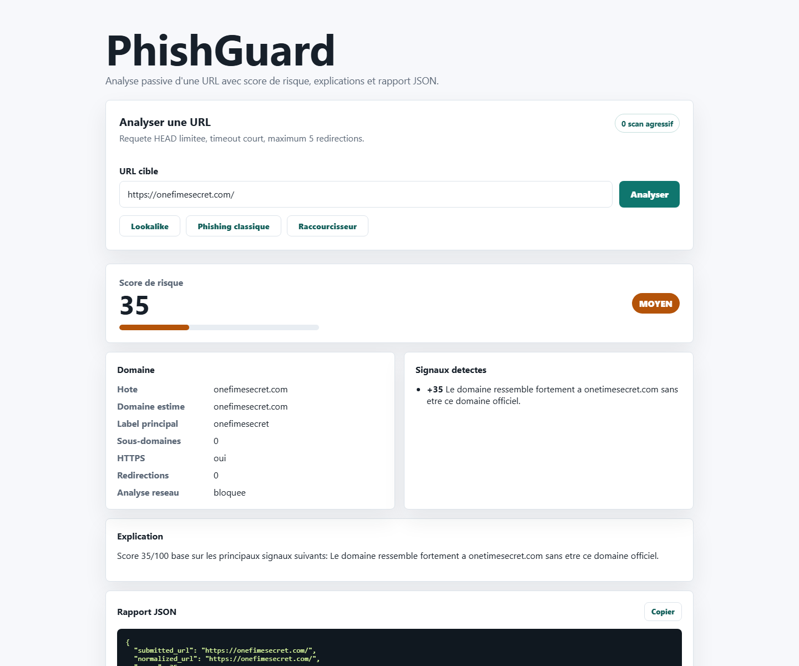

# PhishGuard

PhishGuard est une application web de cybersecurite qui analyse une URL et estime son risque de phishing avec un score de 0 a 100. Le projet est volontairement simple, propre et explicable: FastAPI, frontend statique, Docker, tests et rapport JSON.



## Fonctionnalites

- Analyse passive d'une URL depuis une interface web
- Score de risque lisible avec jauge visuelle
- Detection de signaux de phishing: HTTPS absent, mots suspects, IP directe, Punycode, domaine long, sous-domaines nombreux
- Detection de typosquatting/lookalike via une watchlist configurable
- Analyse limitee des redirections avec requete `HEAD`
- Rapport JSON detaille avec bouton de copie
- Historique local des dernieres analyses dans le navigateur
- Mode demo sans requete reseau pour presenter le projet hors ligne
- Garde-fous anti-abus: timeout court, maximum 5 redirections, blocage des IP privees/locales/reservees

## Ce que le projet demontre

- API REST avec FastAPI
- Separation entre interface, API et logique d'analyse
- Prevention SSRF de base
- Scoring heuristique transparent et explicable
- Watchlist configurable pour domaines imitateurs
- Tests unitaires et tests API
- Conteneurisation Docker
- Documentation claire pour un depot GitHub ou un CV cyber

## Architecture

```text
Navigateur
  -> Frontend statique HTML/CSS/JS
  -> API FastAPI
  -> app/analyzer.py
  -> data/known_brands.json
  -> Rapport JSON + score + explications
```

```text
app/
  analyzer.py          Logique d'analyse et scoring
  main.py              Routes FastAPI
  static/              Interface web
data/
  known_brands.json    Watchlist des marques/domaines officiels
tests/
  test_analyzer.py     Tests de la logique metier
  test_api.py          Tests des endpoints
```

## Limites et securite

PhishGuard ne realise pas de scan agressif, ne lance pas d'exploitation et ne tente pas de contourner les protections d'une cible. L'analyse reseau est limitee a une requete `HEAD` avec timeout court pour observer les redirections.

Les cibles privees, locales ou reservees sont bloquees afin de reduire les risques d'abus et de SSRF. Le score reste indicatif et ne remplace pas une analyse SOC complete, une sandbox, un moteur de reputation ou des flux de threat intelligence.

## Stack

- Backend: Python, FastAPI
- Frontend: HTML, CSS, JavaScript vanilla
- Client HTTP: httpx
- Tests: pytest
- Conteneurisation: Docker, Docker Compose

## Installation locale

```bash
python -m venv .venv
source .venv/bin/activate
pip install -r requirements.txt
uvicorn app.main:app --reload
```

Sous Windows PowerShell:

```powershell
python -m venv .venv
.\.venv\Scripts\Activate.ps1
pip install -r requirements.txt
uvicorn app.main:app --reload
```

Application:

```text
http://localhost:8000
```

Demo automatique:

```text
http://localhost:8000/?demo=lookalike
```

## Configuration

Copier le fichier d'exemple si besoin:

```bash
cp .env.example .env
```

Variables disponibles:

```text
PHISHGUARD_MAX_REDIRECTS=5
PHISHGUARD_REQUEST_TIMEOUT_SECONDS=5
```

## Docker

```bash
docker compose up --build
```

## API

### `POST /api/analyze`

Requete:

```json
{
  "url": "https://onefimesecret.com/",
  "demo_mode": true
}
```

Reponse abregee:

```json
{
  "normalized_url": "https://onefimesecret.com/",
  "score": 35,
  "risk_level": "medium",
  "demo_mode": true,
  "domain": {
    "hostname": "onefimesecret.com",
    "registered_domain_estimate": "onefimesecret.com",
    "brand_lookalikes": [
      {
        "target_brand": "onetimesecret",
        "official_domain": "onetimesecret.com",
        "match_type": "lookalike",
        "edit_distance": 1
      }
    ]
  },
  "findings": [
    {
      "name": "brand_impersonation",
      "risk_points": 35,
      "category": "domain_risk",
      "explanation": "Le domaine ressemble fortement a onetimesecret.com sans etre ce domaine officiel."
    }
  ]
}
```

### `GET /api/brands`

Retourne la watchlist locale chargee depuis `data/known_brands.json`.

## Watchlist

La watchlist est stockee dans:

```text
data/known_brands.json
```

Elle peut etre enrichie sans modifier le code Python:

```json
{
  "github": "github.com",
  "google": "google.com",
  "onetimesecret": "onetimesecret.com"
}
```

## Tests

```bash
pytest
```

## Methode de scoring

Le score additionne des signaux de risque plafonnes a 100:

- `domain_risk`: IP directe, Punycode, lookalike, domaine long, sous-domaines nombreux, raccourcisseur d'URL
- `transport_risk`: absence de HTTPS, port non standard, downgrade HTTPS vers HTTP
- `redirect_risk`: redirections multiples, changement de domaine, redirections trop nombreuses
- `content_risk`: mots suspects dans l'URL comme `login`, `verify`, `account`, `password`
